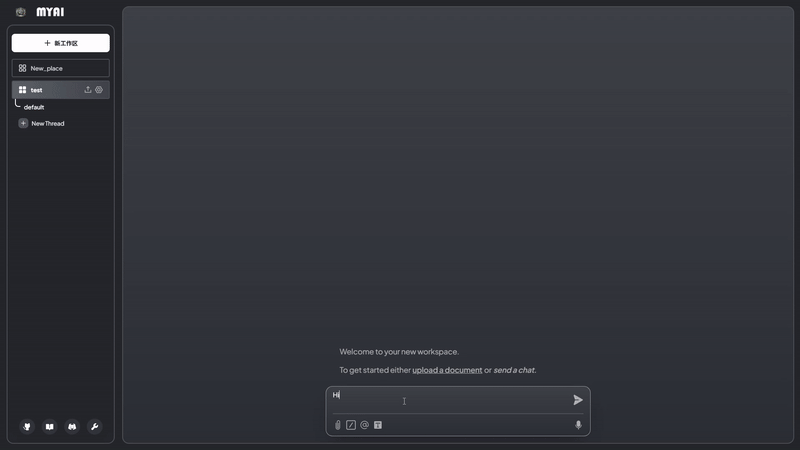
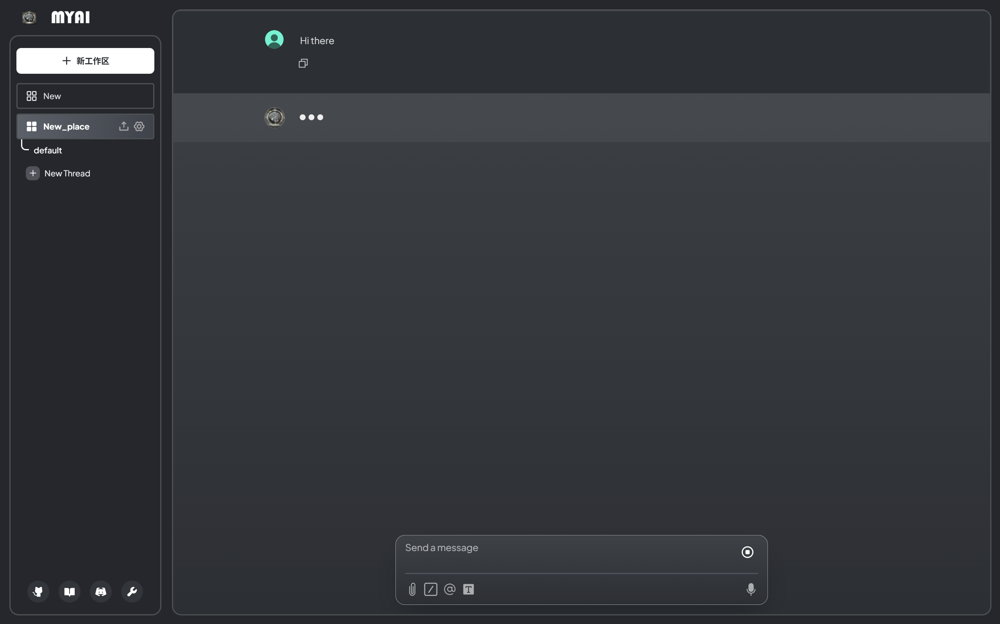
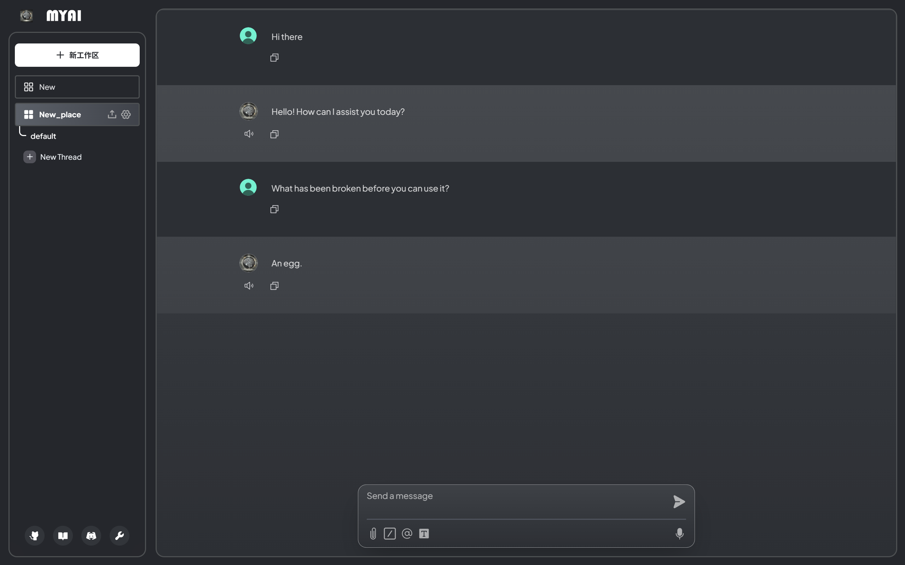
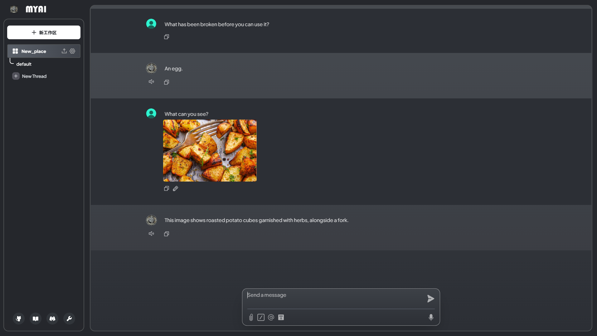
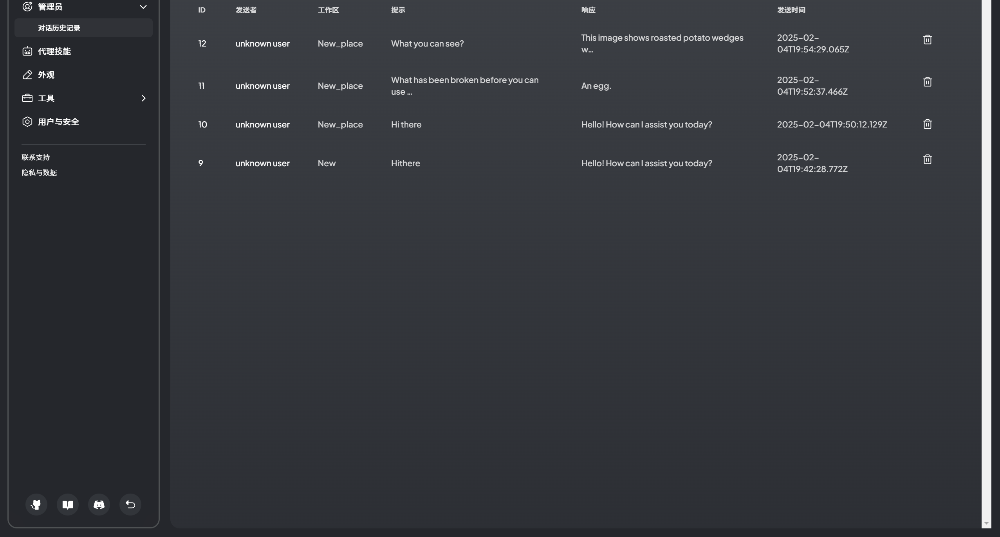

# 🚀 MYAi

  

  <b>An advanced AI-powered application with cutting-edge technology.</b> 
  Built for developers, businesses, and AI enthusiasts looking to harness the power of LLMs and vector databases.

  <a href="#🚀-live-demo">🚀 Live Demo</a> | <a href="#features">✨ Features</a> | <a href="#Technology Stack">🛠 Technology</a> 

  🚀 Developed with ❤️ by <a href="guonazhi.site">NzG</a>

---

## 🌟 Overview

**MYAi** is a next-generation AI assistant that seamlessly integrates cutting-edge LLMs, multi-modal processing, and automation to enhance productivity, creativity, and intelligent decision-making. Designed for individuals, teams, and enterprises, this platform offers advanced AI chat, document interaction, code generation, and custom AI agent deployment—all within a sleek, secure, and scalable environment.

---

## 🚀 Live Demo

  

---

## ✨ Features

- 🏆 **Advanced AI Chat** – Engage with cutting-edge LLMs, supporting multi-turn conversations, contextual understanding, and personalized interactions.
- 🖼️ **Multi-Modal Intelligence** – Process text, images, audio, code, and more for enhanced AI-powered interactions.
- 👥 **Advanced Document Processing** – Interact with PDFs, Word, Excel, and PowerPoint to extract, summarize, and analyze content.
- 🛠 **AI-Powered Code Generation & Debugging** – Generate, optimize, and debug code with AI assistance, supporting languages like Python, JavaScript, C++, and more.
- 📖 **Semantic Search & Vector Database Integration** – Leverage AI-powered embeddings for ultra-fast retrieval and intelligent document search.
- 🧠 **Real-time AI Performance Monitoring** – Track API usage, response times, cost analytics, and AI model performance in real time.
- 🔥 **Real-time AI Monitoring** – Track API usage, response times, cost analytics, and AI model performance in real time.
- 🔗 **Plugin Ecosystem & API Extensions** – Seamlessly integrate with OpenAI, Anthropic, Google Gemini, Claude, Llama, and custom-built plugins.
- 🏗 **Memory & Long-Term Context Retention** – AI remembers past interactions, providing a more personalized and consistent experience.
- 🌍 **Multilingual & Cross-Cultural AI Support** – Communicate in 100+ languages with real-time translation and AI-powered multilingual understanding.
- 🎨 **Modern & Intuitive UI/UX** – Sleek, responsive design optimized for desktop, mobile, and web, providing a seamless AI experience.

---

## 🛠 Technology Stack

- **Programming Languages**: TypeScript, Python
- **Frameworks**: Node.js, React, Express.js
- **Databases**: Prisma ORM
- **Styling**: Tailwind CSS
- **API Documentation**: Swagger
- **Security**:  JWT
- **Cloud Providers**: AWS
- **Task Scheduling & Jobs:**: Node.js Worker Jobs
- **CI/CD**: GitHub Actions, ArgoCD

---

## 📖 Supported AI Models & Databases

### **Large Language Models (LLMs):**
- [OpenAI](https://openai.com)
- [Anthropic Claude](https://www.anthropic.com/)
- [Google Gemini](https://ai.google.dev/)
- [Hugging Face Models](https://huggingface.co/)
- [Ollama](https://ollama.ai/)

---

